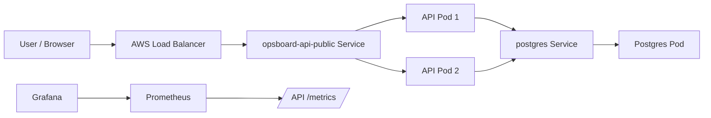

# OpsBoard Architecture

## Request Flow



## Local Development

Local development uses Docker Compose:

```text
api
db
prometheus
grafana
```

The API is built from the local `Dockerfile`. PostgreSQL uses a Docker volume for local persistence. Prometheus scrapes `api:8000/metrics`; Grafana queries Prometheus.

## CI/CD

GitHub Actions performs:

```text
install dependencies
start CI PostgreSQL service
initialize test schema
run pytest
build Docker image
push image to GHCR
deploy to EC2 baseline environment
```

The container image is:

```text
ghcr.io/rokobata510/opsboard-api:latest
```

## Kubernetes

Kubernetes deployment is split into:

```text
k8s/config.yml              non-secret configuration
k8s/secret.example.yml      placeholder secret template
k8s/secret.yml              local ignored secret file
k8s/postgres.yml            Postgres ConfigMap, Deployment, Service
k8s/api-deployment.yml      API Deployment with replicas and probes
k8s/api-service.yml         local NodePort Service
k8s/api-service-aws.yml     AWS LoadBalancer Service
```

The API Deployment uses:

```text
2 replicas
readiness probe on /health
liveness probe on /health
rolling update with maxUnavailable=0 and maxSurge=1
```

## AWS

The AWS Kubernetes path uses:

```text
EKS cluster in eu-central-1
managed node group with t3.medium
AWS LoadBalancer Service for public HTTP access
```

The cluster config lives in:

```text
eksctl/opsboard-cluster.yml
```

## Design Tradeoffs

- PostgreSQL runs inside Kubernetes for learning purposes. A production system should normally use RDS or another managed database.
- `k8s/secret.yml` is ignored locally. Production secrets should come from a stronger mechanism such as AWS Secrets Manager, External Secrets Operator, SOPS, or Sealed Secrets.
- The public endpoint uses a simple LoadBalancer Service, not a full Ingress controller with TLS.
- The API runs with two replicas, but the database remains single-instance.
- Observability is included locally through Prometheus and Grafana; the EKS deployment currently focuses on the public API path.
